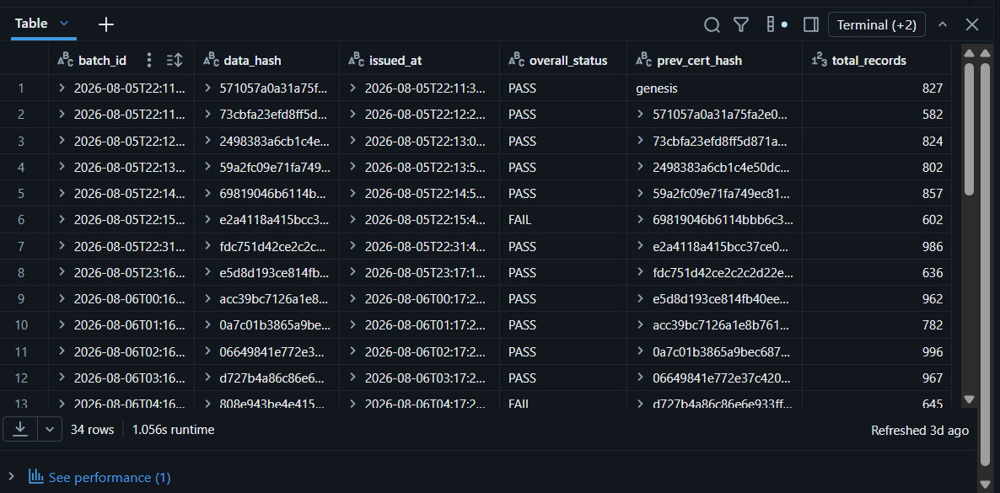
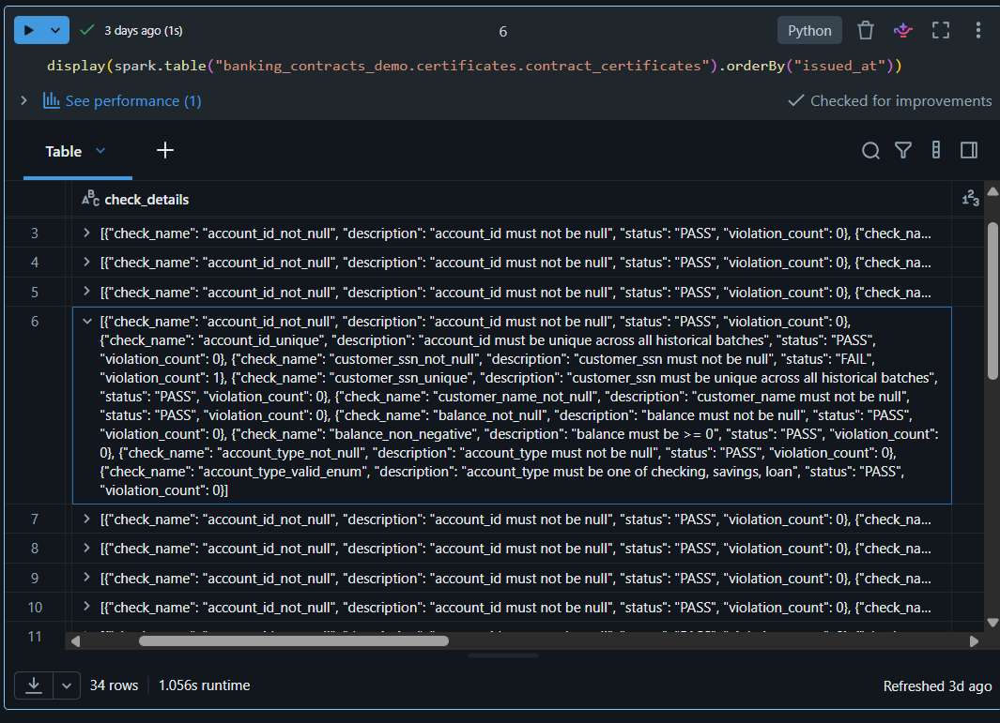
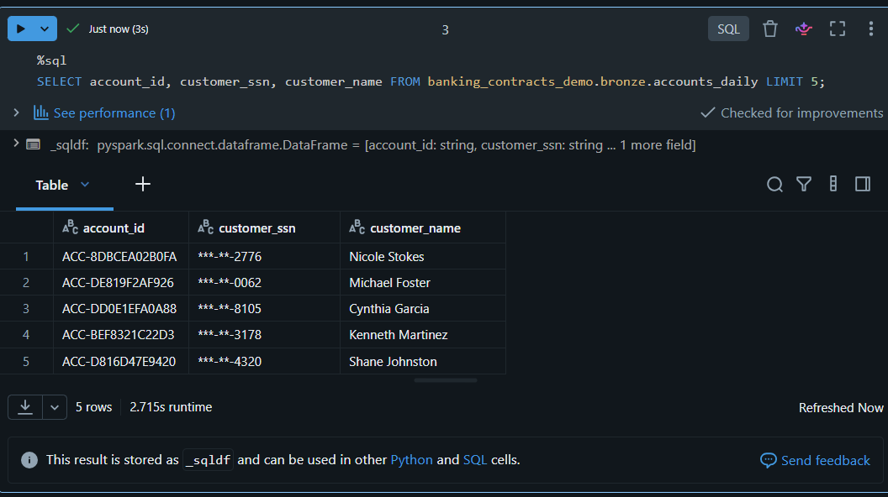
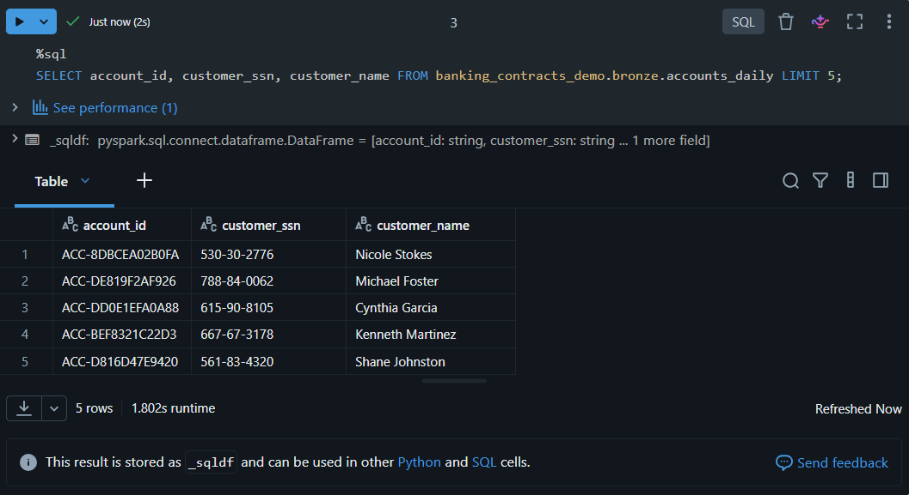
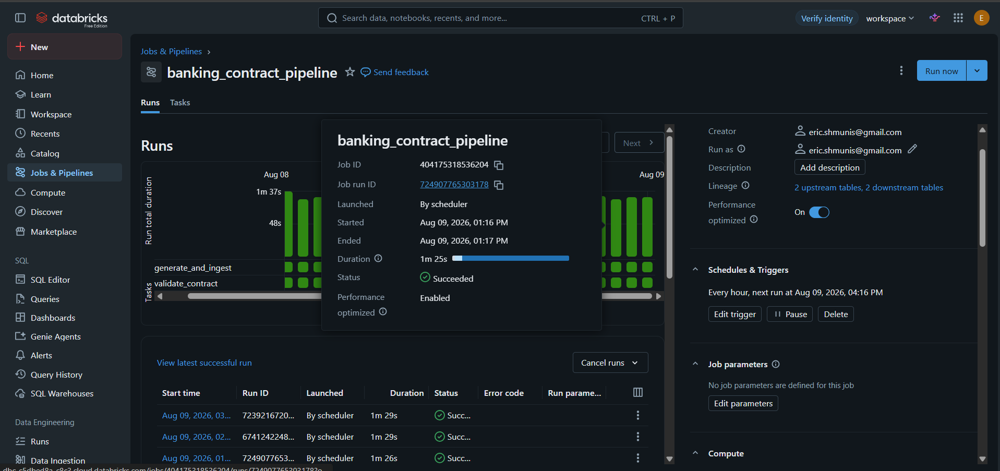

# Banking Data Contract Enforcement Pipeline

A data contract enforcement pipeline for a banking scenario, built on
**Databricks Free Edition**. I built this to actually understand the data
contracts paradigm, Delta Lake, Unity Catalog, and PII governance, instead
of just reading about them.

## What this project does

This pipeline simulates a bank's data platform ingesting daily account
records. It enforces an explicit data contract on every batch, issues a
tamper-evident certificate recording the result, and applies real
column-level PII masking. The whole thing runs automatically on a schedule,
no manual intervention needed.

## Architecture

**Bronze layer.** Synthetic banking account data (generated with
[Faker](https://faker.readthedocs.io/)) gets ingested incrementally, one
batch per run, tagged with a `batch_id` and appended to a Delta table.

**Validation.** Each new batch is checked against
`contracts/accounts_daily.yml`: schema (types, nullability, uniqueness),
business rules (e.g. `balance >= 0`), and uniqueness checks that span all
historical batches, not just the current one.

**Certificates.** Every validation run produces a signed record (a SHA-256
hash of the batch's data, a pass/fail verdict, and per-check results) that
chains back to the previous certificate's hash. This builds an auditable,
tamper-evident history over time.

**PII governance.** `customer_ssn` is flagged as PII in the contract and
protected with a real Unity Catalog column mask. Only members of a
`compliance_team` group can see unmasked values; everyone else sees a
redacted version (`***-**-1234`). This is enforced at the table level,
separate from the validation pipeline's own logic.

**Automation.** The full pipeline (generate, ingest, validate, certify)
runs automatically every hour via a scheduled Databricks Job.

## What's here

- **`contracts/accounts_daily.yml`**: the data contract itself. Schema,
  validation rules, and PII governance policy.
- **`01_generate_and_ingest`** (Databricks notebook): generates synthetic
  account data with a realistic, probabilistic error rate and appends it to
  the Bronze Delta table.
- **`02_validate_contract`** (Databricks notebook): validates the latest
  batch against the contract and issues a hash-chained certificate.
- **`generate_data.py`** and **`requirements.txt`**: the original local data
  generation scaffold from early on in the project, superseded by the
  in-Databricks version in `01_generate_and_ingest`. Kept here for
  reference.

## A note on what's in this repo vs. what's in Databricks

The files in this repo are the code and contract definition. A few things
that make the pipeline actually work are configured directly in the
Databricks workspace and won't show up by browsing GitHub:

- The Unity Catalog structure (the `banking_contracts_demo` catalog and its
  schemas), and the `mask_ssn` masking function referenced in the contract's
  governance section.
- The `compliance_team` group used to control who sees unmasked SSN values.
- The scheduled Databricks Job that runs the pipeline automatically every
  hour.

## Status

The core pipeline is done and running automatically. Right now it handles:

- Contract-based schema and rule validation
- Hash-chained certificates with genesis/chain linking
- Realistic, probabilistic error simulation
- Cross-batch uniqueness checks
- Unity Catalog PII masking for `customer_ssn`, tested and documented in the
  contract
- An automated hourly Databricks Job orchestrating the full pipeline

## Screenshots

**Certificate chain.** Each certificate's `prev_cert_hash` matches the
previous certificate's `data_hash`, forming a traceable, tamper-evident
history across every batch that's been validated.

**A caught failure.** One batch's full check breakdown, showing a null SSN
correctly flagged while every other check passes.

**PII masking, default view.** `customer_ssn` shown to a user who isn't in
the `compliance_team` group.

**PII masking, authorized view.** Same rows, same query, but from a
`compliance_team` member. SSNs are unmasked.

**Automated job history.** The pipeline running on its own hourly schedule,
launched "By scheduler," not manually triggered.

## Possible next steps

- CI/CD integration: run contract checks automatically through GitHub
  Actions on pull requests.
- Convert the validation logic to native Lakeflow Declarative Pipeline
  expectations.
- Explicit schema enforcement at write time (right now it's validated
  after ingestion, not enforced at the point of write).

## Note on data

`customer_ssn` is flagged as PII in the contract. All data used in this
project is synthetic (Faker-generated). No real customer data is used
anywhere.
